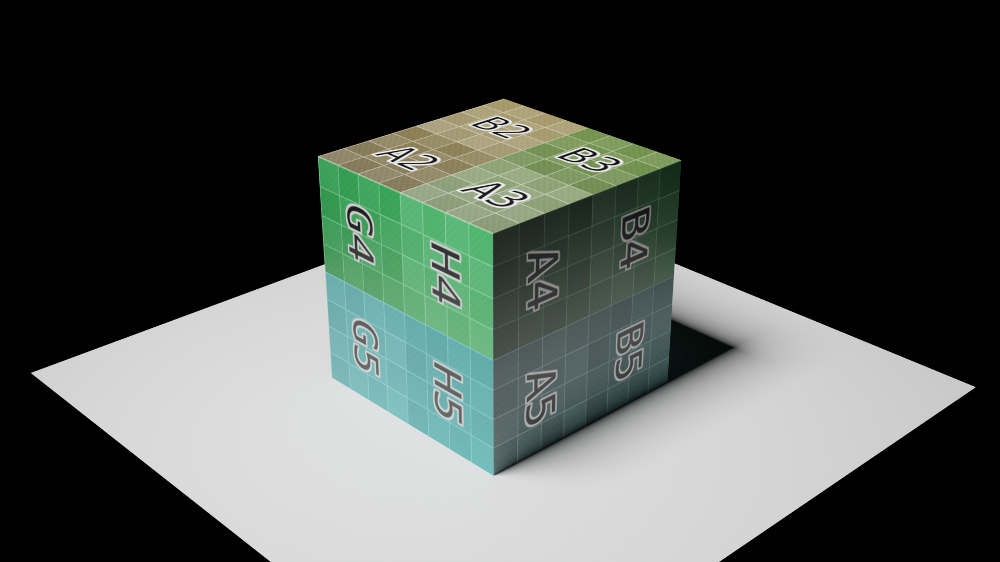
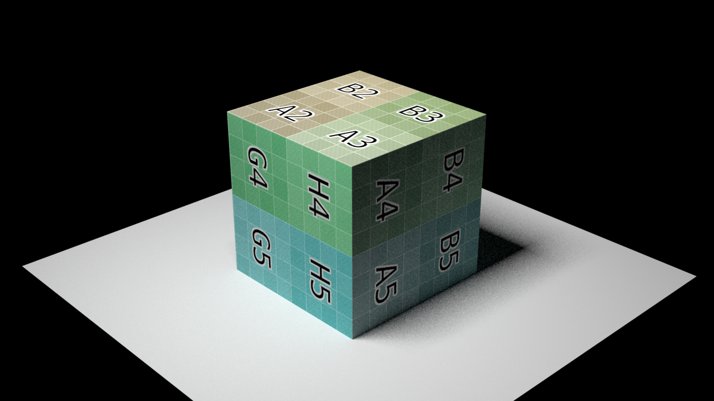
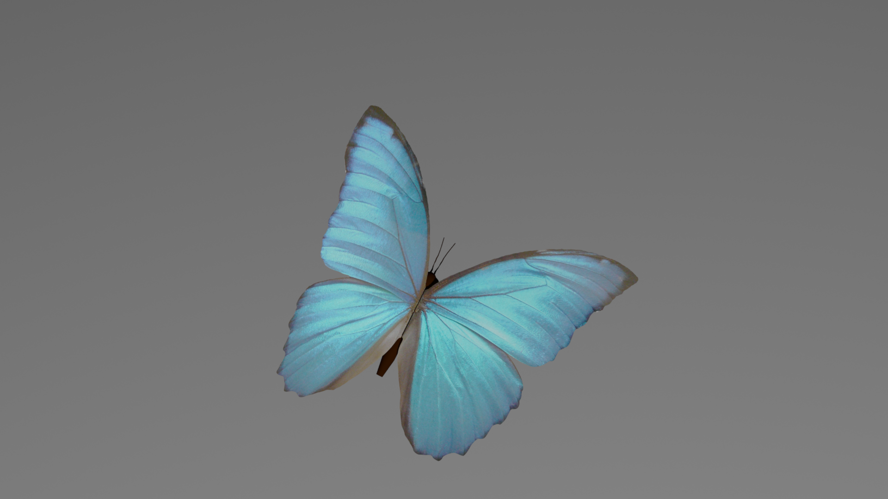
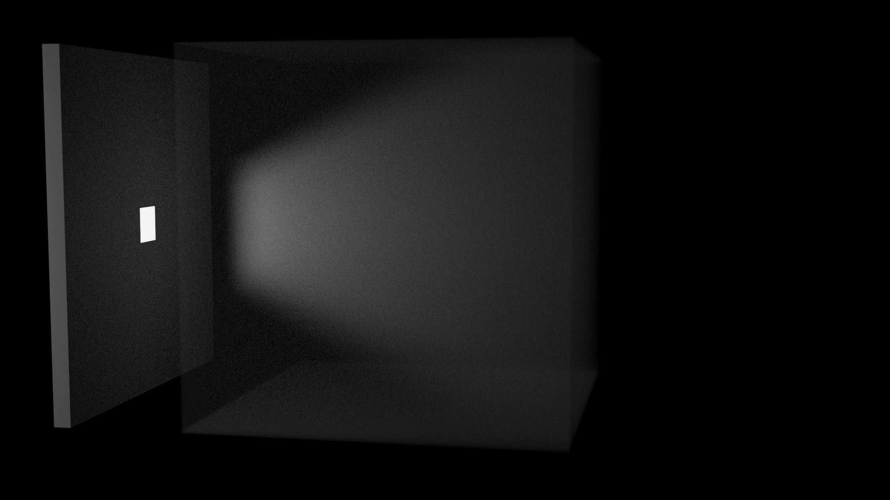
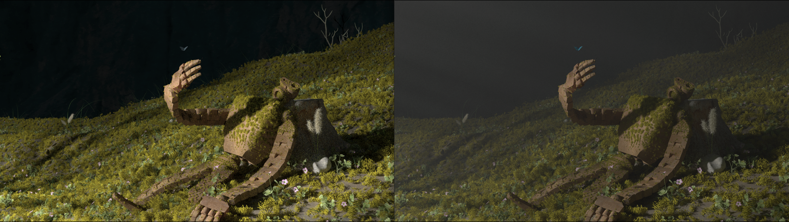
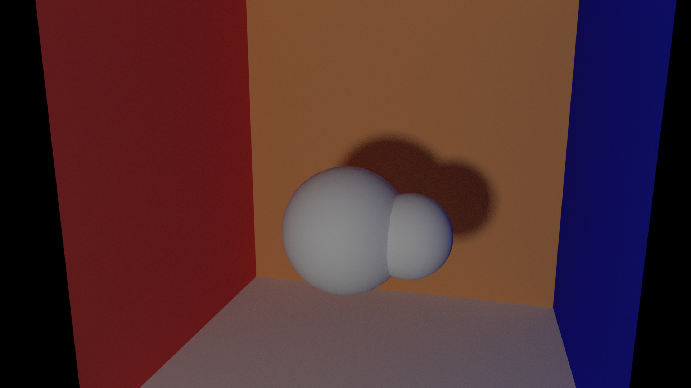

基于[PBRT](https://pbr-book.org/)的离线渲染引擎，基本框架是[Nori](http://rgl.epfl.ch/software/Nori2). 

What we have done in this course and project is to extend this basic renderer to support more full-fledged physically-based lighting/integrating/bsdf functions...

The technical details in this passage may not be perfect.

<!--more-->

Final project was to choose several features from many choices and realize them. What I chose were modeling using Blender, Texture, Homogeneous participating media and Object instancing. 

Motivation
==========

A damaged, decaying humanoid machine next to a grassy hillside. I would like to show the loop of death and rebirth using a vibrant scene next to a discarded robot. Butterfly also means rebirth in some culture.

Motivational image: 


*Tales from the Loop* by Simon Stalenhag


*Castle in the Sky* by Tokuma Shoten

Final Render
===


Feature 1 3D Mesh Design
=========

**Description**

I used the image from animation to model 3D meshes in Blender and gave them a pose. The mesh that I modeled are the robot and grass, and a tree that is used to generate god ray but not presents in the scene.


Feature 2 Textures
=========

**Description**

Without textures we cannot present a colorful world. The basic idea is that the texture uses the image's RGB information to give our BSDF a specific albedo. In blender, if we uses a UV mapping to let the object know which part of an image its vertices should be mapped to, it will write the corresponding UV coordinates while exporting. UV coordinates are between $[0, 1] \times [0,1]$, which shows the relative location of a point of an image that each vertex is binded. When we evaluate or sample the scattering behavior at the intersection, the UV coorinates have been loaded and recorded in the texture coordinates of mesh so we use the color at that point in the picture instead of an default albedo.

**Design choice**

Here we only consider the 2D (u, v) mapping. Since the UV coordinates are actually "portion" between 0 and 1, we need to use this value and the size of the reference picture to get the absolute coordinate in it. 

`$$
\begin{aligned}
x = u * width \\
y = v * height
\end{aligned}
$$`

We create a **Texture** class to store the image information, including the name, size and the address of the imported image. The public methods includes the constructor which receives a path and load the corresponding image, and `getTexel` to access the texel given UV coordinates.

We use the `stbi_image` library to read the image. `stbi_load` method receives the path of the file (which we preprocess using `getFileResolver()` of `nori`) and the channels we expect, then returns the pointer to the address of the image, actual size and channels of the picture.

Take three channels as an example, the image is stored as an array of "RGBRGBRGB...", each takes size of an 'unsigned char *'. Thus when we want to get RGB at an intersection, we first calculate the index in the image `(its.uv[0], its.uv[1]) -> (x, y)`, then get the 1D array location `ty * width + tx`, and times the number of channels to get the actual location in the picture `#channel * (ty * width + tx)`. Also, for 4 channels images, if we tell `stbi_load` that we just want 3 channels, it will give us the array of "RGBRGBRGB..." but not "RGBARGBA..." 

What needs to be noted is that sRGB and linearRGB are different. So we need to use [color correction](https://www.pbr-book.org/3ed-2018/Texture/Image_Texture)

**Validation**

We use the UV mapping in blender to generate correct texture coordinates and export it, then test it in our renderer.

1. Square picture 

The upper one is rendered by Blender. The texture picture is a 4-channel "color.png"





2. Rectengular picture

The upper one is rendered by Blender. The texture picture is a 3-channel "blue.jpg"




Feature 3 Homogeneous media
=========
**Description**

There are many ways to implement homogeneous participating media. We use the simplest one: free path sampling. When travelling in the media, the ray has a probability that continue to travel, or scatter (which means the next interaction happens). 

If we don't consider the emission, the volume rendering equation is like this:

`$$
\begin{aligned}
L(\mathbf{x}, \vec{\omega}) &=T_{r}\left(\mathbf{x}, \mathbf{x}_{z}\right) L\left(\mathbf{x}_{z}, \vec{\omega}\right) \\
&+\int_{0}^{z} T_{r}\left(\mathbf{x}, \mathbf{x}_{t}\right) \sigma_{s}\left(\mathbf{x}_{t}\right) \int_{S^{2}} f_{p}\left(\mathbf{x}_{t}, \vec{\omega}^{\prime}, \vec{\omega}\right) L_{i}\left(\mathbf{x}_{t}, \vec{\omega}^{\prime}\right) d \vec{\omega}^{\prime} d t
\end{aligned}
$$`

Where `$L\left(\mathbf{x}_{z}, \vec{\omega}\right)$` is the radiance background surface radiance, and the second term is the accumulated in-scattered radiance. We calculate the integral by Monte-Carlo method, where the integral over distance $\int_0^z ... dt$ we use the free path sampling to get the probability of how long the ray travels, and the integral over solid angle $\int_{S^2}...d\omega$ we use the phase function to give the next direction and corresponding probability. I use the graph below to show my path tracer. I assume that there is no emitter inside the medium


**Design choice**

As the figure shows, we need to consider different situations. I will follow the code logic to explain each of them. In my implementation the ray has a record of the medium it is passing by, and there is only one because I don't consider nested medium.

We have a throughput $\beta$. The ray begins to find the intersection. 

It may hit the emitter (which is not shown here). Like other path tracer, if this ray is directly from the eye or last bounce there is no direct illumination, we add $\beta L_e$. 

If it hits a mesh that does not have BSDF and the normal shows the ray is outside this mesh (black ray (2)), we think it's about to go into the volume, so we change the media of the ray `<highlight ray.media = its.mesh->getMedium()>` and change its source `ray.o = its.p` and `maxt` to the intersection, continue to find the intersection. After this process we see it as a new ray. If after this we find the ray does not have `media` and the intersection (maybe the new intersection) does not have a `BSDF`, some tricky case happens, e.g. two boundaries are tangent to each other and too close, we just stop.

If we find the ray does not have media (purple ray (1)), we are happy. We just need to use the normal direct illumination and mark the variable `direct` as `true`. 

However, when we are checking if the shadow ray is blocked in situation (1), we need to consider the medium the ray passes by (green ray (3)). If the ray just travels through it and there is no other mesh in the way, we add the radiance of the emitter $\beta L_e$ multiplied by an attenuation term $T_r$ and the probability `pdf` that this ray will not scatter (in our homogeneous case, `pdf` = $e^{-\sigma _t t}$ where $t$ is the distance the ray stays in the medium).

If the ray has media. We need to sample the free path first. If our sampled distance is less than that between the ray source and the intersection, scatter happens in the medium (orange ray (4)). The ray's direction may be changed by the phase function and the throughput is multiplied by $T_r(t)$ * $\sigma_s$ * pf->eval($\omega$) / (pdf_t * pdf_{$\omega'$}). We can also apply the direct illumination by take the attenuation and the pdf into consideration. 

If our sampled distance is greater than the distance between the ray source and the intersection, we hit a mesh in the medium. If the mesh has a BSDF (black ray (2)), we evaluate the BSDF and use it to get the ray for next interaction. We can also consider direct illumination. If the mesh does not has a BSDF but has a Medium, it means we hit the boundary of the medium from inside. We just calculate the attenuation and change the source and the max length of the ray and continue. In this situation we don't change the value of `direct`, and there is no scattering happens.

We still use Russian Roulette to stop the process.

I created a class called `Medium` and `PhaseFunction`. `PhaseFunction` is just like `BSDF` class, to sample the new direction and to get the probability by inquiring by a `struct PFQueryRecord`. It is a child of medium property, and in my case I only registered the "isotropic" phase function. `Medium` is a child of mesh. The instance of `Medium` can be created while parsing and the `Mesh` it belongs to will have a pointer to it. `Medium` has a method called `pdf` and I use it to evaluate the probability that a ray can travel how long.

Different kinds of `Medium` can be registered. I created the homogeneous one for the scene and the empty one for test.

**Validation**

1. Empty 

Empty medium is quite simple. Its $T_r$ and $pdf$ is just 1.f and the `Sample` method just "forward" the ray in its direction.

The empty medium should generate exactly same figure as no medium. In the picture we could see a line that shows the existence of bigger ball. Because my renderer uses the intersection and its mesh's BSDF/Medium pointer to determine the location of the ray, it does not handle the case where the light and the boundary are almost tangent/interleaved mesh and volume very well.

The upper is the scene rendered by Blender `cycles`.


2. God ray test

The upper is the scene rendered by Blender `cycles`. Both renderer uses 1024 samples/pixel. There are still some problems regarding how to determine what kind of interaction is, so the wall cannot be too close to the volume. The difference may be because the parameters are different.



The scene with and without fog:



3. Numerical validation?

Sadly, I could not find a mathematical way to validate it. Though I think I have considered all the situation, it seems to be a kind of "single scattering" which is an incomplete method so not mathematically perfect.

Feature 4 Object instancing
=========
**Description**

I need to generate tens of thousands of grass and leaves. Though the mesh is small, thousands of objects and the instance of their BSDF/Medium is really a burden to memory. Therefore, we can use object instancing to give each of these repeated objects a pointer that points to a real object, but they themselves are a new kind of class that only contains a pointer and the transform matrix, and its own bounding box. As for BSDF (it can be independent but in my case it is a nullptr) and vertices position information, it only use those of its parent. By this, we avoid use up the memory. By modifying the exporting script for Blender, it will not export the `.obj` file for those "children" objects but only their transform.

**Design choice**

I design a new class inherited from the `Mesh` class called `TransformedMesh`, that has all its vertex matrix/uv matrix/BSDF... empty, except for a transform matrix, a pointer to its parent, and a bounding box of its real location. When we want to inquire its member, such as BSDF, or a position of a point, it calls the corresponding method of its parent, and if needed, add a transform to it. The information that needs to be transformed directly includes: `surfaceArea`, `totalArea`, `getBoundingBox`. For methods that need to get the position and ray intersection, we do not change it directly, because we handle it in the accelerating structure.

This new class is a registered `NoriObject`, which is called `tmesh`. Each `TransformedMesh` is a child of `WavefrontOBJ` it is binded to, the easiest way to establish this relationship is to let the `tmesh` be children of the `obj` in the `.xml` file, and while parsing the file, we can add the parent pointer to child and load the transform matrix of child. Type `tmesh` can only be child of `mesh`, otherwise the program will complain about "Segment Fault" when the null pointer of `tmesh` calls its methods. We also get the bounding box of child at the very first, because building the acceleration structure needs all of the meshes and their bounding boxes. We should use a vector to record each child of an `obj` Mesh, and when its `Scene` is adding child, the Mesh should tell the Scene there are more `tmesh` meshes. To save memory, we empty this vector after that.

When doing ray intersection, it is important to note that we cannot return a temporary reference inside a function, and that's why I need to apply transform in the `accel.cpp` but not the methods of `TransformedMesh` itself. The bounding box of each `tmesh` should be its real position because when we are looking for intersection, we must ensure the `ray.maxt` is updated correctly. When we are using the `RayIntersect()` method of `Mesh` (but not `Accel`), we should transform the ray to the corresponding ray for the "parent" mesh, so an inverse transform is applied. After finding the intersection, we only need to apply the transform to its intersection position, the distance between ray source and the intersection point, its geometry normal and shading normal. For a normal `mesh`, the transform will also be applied, but it is an identity transform.

For the Blender part, first I need to design a simple mesh like grass or leaf, and use the "particle system" in Blender to generate tens of thousands of them, use the "weight mode" to adjust the distribution of grass and leaves. These objects have a parent object and Blender records the transform that each of them apply to the origin parent object.

Then I need to change the exporting file for Blender `io_nori.py` to `io_nori_matrix.py`, because it's meaningless to export so many meshes that will not be loaded by nori. Thanks to the `matrix_world` API of `bpy`, we can use it to get the transform of each "child" object with respect to its parent. To distinguish between "parent" and "child" object, I set the transform of all "parent" objects, i.e. objects that should be exported as type "obj" to be identity (using "Apply all the transform" in Blender), and keep the transform of "child" objects, i.e. objects that should be exported as type "tmesh". While exporting, check if the transform of the objects is identity. If yes, write the ".obj" file, otherwise only write its transform to the ".xml" file. A tricky part here is  that the transform matrix should be transformed itself due to the `nori`'s strange perspective, which has a coordinate of (x, -z, y). From linear algebra we know the transform we need is a $4 \times 4$ matrix

`$$
 P = 
\begin{bmatrix}
1 &  &  & \\ 
 &  & -1 & \\ 
 & 1 &  & \\ 
 &  &  & 1
\end{bmatrix} 
$$`

and we apply it to the matrix we get from `matrix_world` $T$

`$$
P^{\top}TP
$$`

Then we can get a correct transform matrix, and the export plugin will generate a `tmesh` object like this 

```XML
<mesh type="tmesh">
    <string name="filename" value="meshes/big.obj"/>
    <transform name="toWorld">
        <matrix value="1.5,0.0,0.0,0.0,0.0,1.5,0.0,0.0,0.0,0.0,1.5,1.0,0.0,0.0,0.0,1.0"/>
    </transform>
</mesh>
```

I haven't figured out how to make the "tmesh" to be the child of "obj" when exporting, so after generating all the `obj` and `tmesh` mesh description, we should manually move the tmesh part into its corrsponding parent, like this:

```XML
<mesh type="obj">
    <string name="filename" value="meshes/small.obj"/>
    <bsdf type="diffuse">
        <color name="albedo" value="0.800000011920929,0.800000011920929,0.800000011920929"/>
    </bsdf>
    <mesh type="tmesh">
        <string name="filename" value="meshes/big.obj"/>
        <transform name="toWorld">
            <matrix value="1.5,0.0,0.0,0.0,0.0,1.5,0.0,0.0,0.0,0.0,1.5,1.0,0.0,0.0,0.0,1.0"/>
        </transform>
    </mesh>
</mesh>
```


**Validation**

1. Two objects vs one object with a transformed tmesh

In blender the real scence is like this:


where the big ball has a transform of scale and displacement in y direction with respect to the small one, and the small ball has applied all the transform (identity matrix).

We use the example above to render using two objects (small.obj & big.obj) or only use the small ball and a transform of it.

We can get the same output





The actual transform is that the big ball is twice the size of small ball, and then translate 1.5m in the negative direction of the y-axis. However, from the transform matrix we could see the translation is at z axis and changes the sign. We should also note that when apply transform in Blender, the parent object's transform should be applied at first, otherwise the matrix we get is not correct.

2. Memory usage 

when rendering my final scene. I have 53000 "grass", 3500 "leave_origin", 10000 "furry", 3000 "shrub_sorrel_01_d", 3000 "shrub_sorrel_01_b", 1000 "Grashalm.002" and other meshes, so the roughly memory should be about 8.3 G only for mesh itself. 


The constructing of BVH uses up to 13.7 GB.


From the `ps v` command, we could see the memory used at constructing stage (11 GB) and rendering stage (4.7 GB):


Therefore the object instancing works.


碎碎念
===

Before this course I didn't know coding and art can be so perfectly integrated. The course is soooooo interesting and the professor & TAs are insightful and helpful. 虽然我在反思，对我来说到底是Blender还是CG中的物理数学概率知识更有意思，否则的话怎么hack point都不做.... Anyway，stay determined, Axiwa! 👩‍💻
